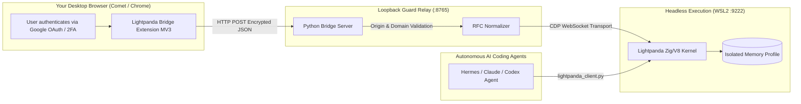

<div align="center">

# 🐼 Lightpanda Session Bridge

### The Authenticated Session Bridge for Machines and Autonomous AI Agents

[](https://github.com/Raknaos/lightpanda-session-bridge/releases)
[](LICENSE)
[](https://chromedevtools.github.io/devtools-protocol/)
[-22c55e.svg?style=flat-square)](https://lightpanda.io)
[](https://raknaos.github.io/lightpanda-session-bridge/)

**[Live Showcase Website](https://raknaos.github.io/lightpanda-session-bridge/)** · **[Architecture](#-architecture)** · **[Quickstart](#-quickstart)** · **[Security Standard](#-security-guarantees)** · **[Python SDK](#-python-sdk)**

<br/>


<p>
Seamlessly bridge real-world authenticated web sessions (Google OAuth, Passkeys, SSO, 2FA) from your primary browser (Chrome / Comet / Edge) into a fast, isolated <b>Lightpanda</b> headless browser runtime in a single click. <b>Zero credentials typed, zero secrets exposed to LLMs.</b>
</p>

</div>

---

## 🌟 Overview

Modern web services (SaaS consoles, API dashboards, cloud providers) protect their dashboards with Google OAuth, multi-factor authentication, and bot mitigations. 

Autonomous AI agents using headless browsers cannot easily log in themselves without requiring sensitive credentials, passwords, or handling complex OTP prompts.

**Lightpanda Session Bridge** solves this fundamental friction:
1. **You log in naturally** in your favorite desktop browser (using your actual Google account or Passkey).
2. **Click the Bridge extension** (or run the CLI tool): your session cookies and local storage are filtered, validated, and injected over CDP into Lightpanda.
3. **Your AI agents operate autonomously** in the background on the real authenticated session at 9x the speed of Chrome and with 16x less memory.

---

## 🔒 Security Guarantees (Zero-Trust Standard)

- **🛡️ Strict Origin Scoping:** Loopback addresses, private networks, identity provider root domains (`accounts.google.com`, `login.microsoftonline.com`, `auth0.com`, `github.com`) are permanently blocked. Only target SaaS domains (e.g., `a6api.com`, `mail.google.com`, `console.cloud.google.com`) are admitted.
- **🍪 RFC 6265bis Compliance (`__Host-` / `__Secure-`):** Domain attributes on domain-locked cookies are automatically normalized to guarantee zero rejection by Lightpanda's CDP parser.
- **⚡ CDP Enum Translation:** Automatic translation of Chromium's lowercase `sameSite` strings (`no_restriction`, `lax`) into strict PascalCase enum tags (`Strict`, `Lax`, `None`) preventing `-31998 InvalidEnumTag` errors.
- **🔑 Zero Secret Leakage:** No passwords, refresh tokens, or API keys are ever stored in disk logs or transmitted in chat histories.

---

## 📐 Architecture



---

## 🚀 Quickstart

### 0. Prerequisites (first time only)
| Requirement | Why | Install |
|---|---|---|
| **WSL2 with Ubuntu** | Lightpanda runs natively in Linux | `wsl --install -d Ubuntu` |
| **Lightpanda binary** (in WSL, `~/lightpanda`) | Headless CDP browser engine | Inside WSL: `curl -fsSL https://pkg.lightpanda.io/install.sh \| bash` (see [lightpanda.io](https://lightpanda.io)) |
| **Python 3.10+** | Relay server & SDK | [python.org](https://www.python.org/downloads/) |
| **Python dependencies** | `websocket-client` for CDP | `pip install -r requirements.txt` |

> **Windows Firewall:** when WSL2 launches Lightpanda, accept the firewall prompt so `127.0.0.1:9222` stays reachable from Windows.

### 1. Clone the repository
```bash
git clone https://github.com/Raknaos/lightpanda-session-bridge.git
cd lightpanda-session-bridge
pip install -r requirements.txt
```

### 2. Launch Lightpanda CDP server (WSL2)
```powershell
./scripts/start-lightpanda.ps1
```
*Listens on `http://127.0.0.1:9222`. Keep this terminal window open.*

### 3. Start the local bridge relay
```powershell
./scripts/start-relay.ps1
```
*Listens on loopback `http://127.0.0.1:8765`. Keep this terminal window open.*

### 4. Install the Chrome Extension
1. Open `chrome://extensions` (or Comet / Edge extension manager).
2. Enable **Developer Mode**.
3. Click **Load unpacked** and select the `extension/` folder.
4. Pin the 🐼 **Lightpanda Bridge** icon to your toolbar.

### 5. Pair the extension with the relay (automatic)
On first use the extension **auto-pairs** with the local relay: the first time you open the popup it fetches the shared secret from the relay's `/v1/bootstrap` endpoint and stores it in its own isolated storage. No manual token copy is needed — just open the popup once with the relay running, then close and reopen it.

> **What if the popup shows `relay offline`?** Start the relay (step 3), then reopen the popup. The badge must read **online** before syncing.

> **Updating the extension:** because Chrome only auto-updates extensions signed for the Chrome Web Store (or pushed via enterprise policy), the `update_url` manifest points at GitHub Releases as a manual-check channel. To update: download the latest `.zip` from [Releases](https://github.com/Raknaos/lightpanda-session-bridge/releases) and **Load unpacked** it again (your relay secret is stored in the extension, so pairing survives reloads). A Web Store publication is planned.

> **Security note:** `/v1/bootstrap` only answers to callers carrying a real `chrome-extension://` Origin — web pages, curl and other local processes are refused (HTTP 403), so the shared secret can only ever reach the official extension.

---

## 🐍 Python SDK (`lightpanda_client.py`)

Once a session is synchronized, autonomous agents can interact directly with the authenticated page:

```python
from lightpanda_client import LightpandaClient

# Connect to the running Lightpanda runtime
client = LightpandaClient(cdp_ws="ws://127.0.0.1:9222/")
client.connect()

# Attach to the synchronized session target
client.attach_or_create("https://a6api.com/console/log")

# Evaluate and extract authenticated data in memory
stats = client.evaluate("""(async () => {
    let res = await fetch('/api/user/self');
    return await res.json();
})()""")

print(f"Logged in user: {stats['data']['username']}")
client.close()
```

---

## 🧪 Security Test Suite

Run the unit test suite covering private IP rejection, IdP blocking, and CDP envelope validation:

```bash
python -m unittest discover -s tests -v
python relay/server.py --self-test
```

---

## 📄 License & Credits

- **License:** MIT License.
- **Upstream Browser Engine:** [Lightpanda.io](https://lightpanda.io) ([GitHub](https://github.com/lightpanda-io/browser)).
- **Bridge Authors:** Raknaos & Nous Research.
